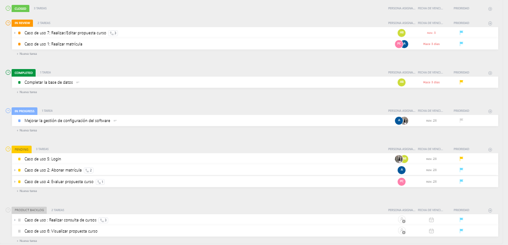
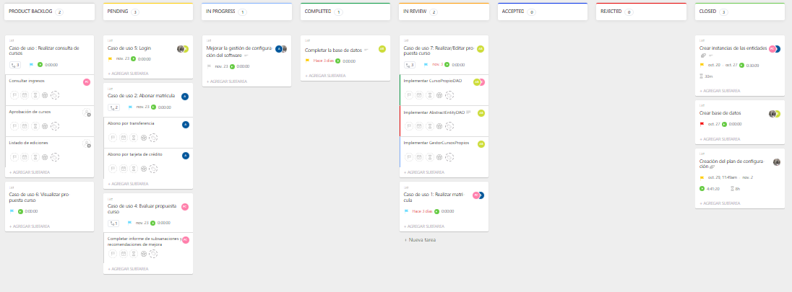

# Reunion de planificación del sprint del dia 16/11/2022

## OBJETIVOS DEL SPRINT

    * Continuar trabajando en la mejora de la gestión de configuración del software.

    * Continuar implementando el caso de uso "Login".

    * Trabajar en el caso de uso "Evaluar propuesta" y  el caso de uso "Abonar matrícula".

