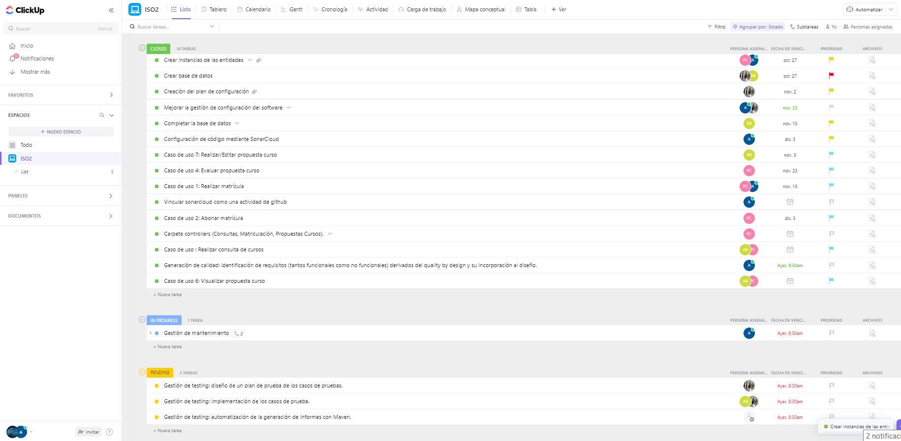
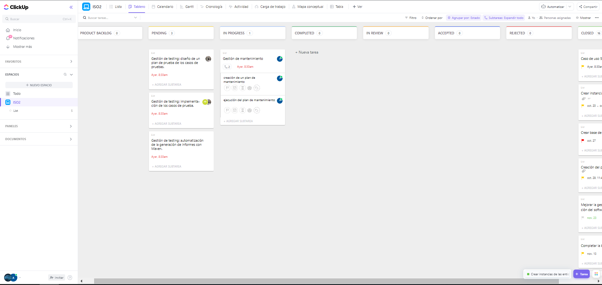

# Reunion de planificación del sprint del dia 22/12/2022

## OBJETIVOS DEL SPRINT

* Gestión de mantenimiento:
    -Continuar con la ejecución del plan de mantenimiento establecido.
    
* Gestión de testing: 
    -Continuar diseñando un plan de prueba de los casos de pruebas.
    -Ir avanzando en la implementación de algunos casos de prueba.
    
* Revisión final del proyecto, análisis detallado de desperfectos y estructurar la presentación con el cliente.

