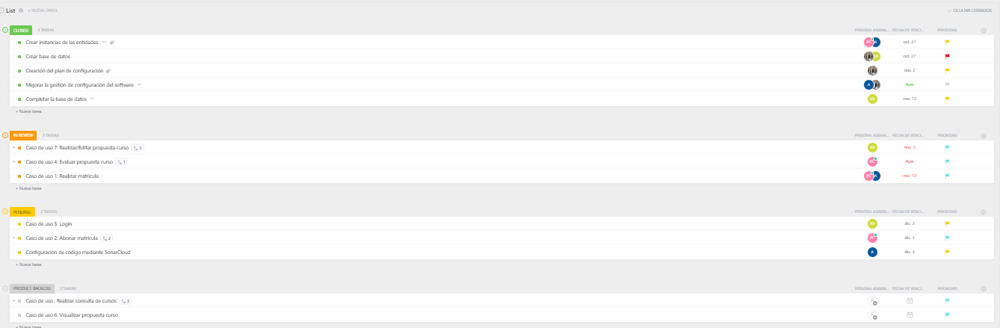
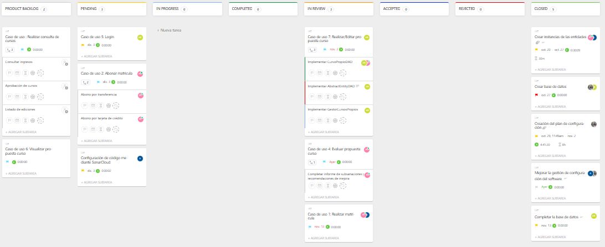

# Reunión de planificación del sprint del día 24/11/2022

## OBJETIVOS DEL SPRINT

    * Configuración de la herramienta SonarCloud para medir la calidad del código.

    * Continuar implementando el caso de uso "Login".

    * Trabajar en el caso de uso "Abonar matrícula".
    
    * Revisar los casos de uso que están en el apartado "in review".

