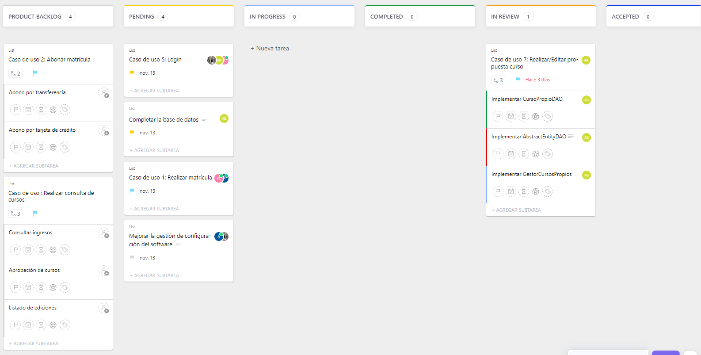
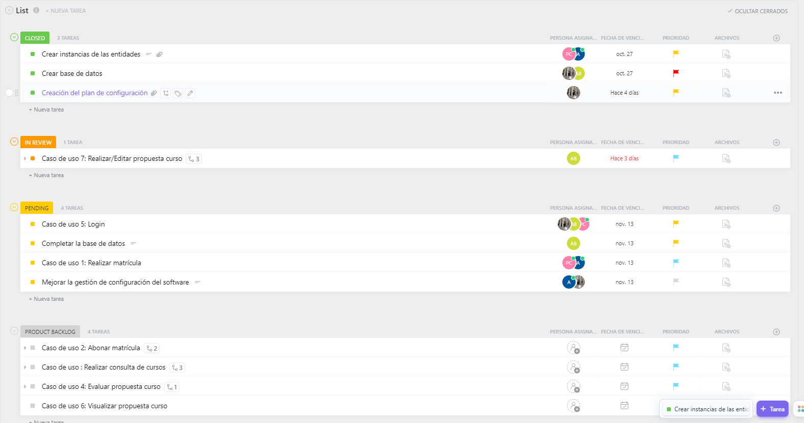

# Reunion de planificación del sprint del dia 6/11/2022

## OBJETIVOS DEL SPRINT

    * Mejorar la gestión de configuración del software:
        - Creacion de más ramas de desarrollo (develop que seria main, la release, features, master)

    * Completar la base de datos: 
        - Implementar los métodos update y delete

    * Trabajar en el caso de uso "Login" y plantear el caso de uso "Realizar matrícula".

